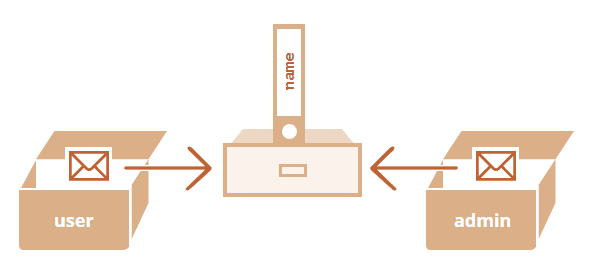

## 참조에 의한 객체 복사
원시타입과 객체의 근본적 차이는 `참조에 의해` 저장되고 복사된다는 점
<br><br>
원시타입은 `값 그대로 저장, 할당, 복사` 가 되는 반면 객체는 `참조값이 저장, 할당, 복사`가 된다

```javascript
let message = "Hello!";
let phrase = message;
```

위와 같이 작성하면 문자열은 원시타입이므로 `Hello!` 라고 하는 값이 복사되어 `phrase` 변수에 저장된다.
<br><br>

따라서 `message`에 저장된 값을 변경하더라도 `phrase` 에는 영향을 미치지 않고 역으로도 동일하다.

<br><br>

반면 객체는 `메모리 주소`를 의미하는 `참조값`이 저장, 할당, 복사된다.

```javascript
let user = {
    name: "John",
}

let admin = user;
```


따라서 `user` 객체의 프로퍼티를 수정하면 `admin` 도 동일한 메모리 주소가 저장되어 있으므로 영향을 받는다.

### 참조에 의한 비교
객체 비교 시에는 동등 연산자 `==` 와 일치 연산자 `===` 가 동일하게 동작한다.

비교할 때 `참조값`을 활용하기 때문이다.

<br></br>


## 객체 복사, 병합과 `Object.assign`
단순히 할당된 객체를 복사하면 참조값이 복사될 뿐이므로 실제 객체를 복사하고 싶다면 새로운 객체를 만들고 프로퍼티를 순회해 원시 수준까지 복사하면 된다.
```javascript
let user = {
    name: "John",
    age: 30,
}

let clone = {}

for (const key in user) {
    clone[key] = user[key]
}
```
아니면 `Object.assign` 을 사용하는 방법도 있다.

```javascript
Object.assign(dest, [src1, src2, src3, ...])
```
`dest` : 목표로 하는 객체<br>
`src?`: 복사하고자 하는 객체

객체 `src?` 의 프로퍼티를 `dest`에 복사하고 `dest` 를 반환

```javascript
let user = {
    name: "John",
}


let permission1 = {
    canView: true,
}

let permission2 = {
    canEdit: true,
}

Object.assign(user, permission1, permission2)

/*
user = {
    name: "John",
    canView: true,
    canEdit: true,
}
*/
```
만약 복사하고자 하는 객체와, 목표로 하는 객체에 동일한 프로퍼티가 존재하면 덮어써진다.

<br></br>

## 중첩 객체 복사
프로퍼티의 값은 모든 자료형을 허용하기 때문에 값이 객체인 경우도 존재할 수 있다.
```javascript
let user = {
    name: "John",
    sizes: {
        height: 182,
        width: 50
    }
}
```
이런 경우 `clone.sizes = user.sizes` 로는 복사가 불가능하다.
<br><br>
따라서 이 때는 유저 객체의 프로퍼티 값을 검사하면서 객체인 경우 그 객체의 구조도 복사하는 반복문을 사용해야 한다.
<br><br>
물론 자바스크립트 `lodash` 라이브러리의 메서드인 `_.cloneDeep(obj)` 를 사용하면 깊은 복사를 처리할 수 있다.