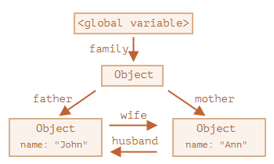
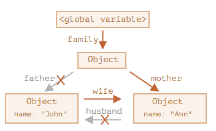
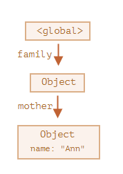

## 가비지 컬렉션 기준
자바스크립트는 `도달 가능성` 이라는 개념을 사용해 메모리를 관리한다.<br>

`도달 가능한` 값 은 어떻게든 접근하거나 사용할 수 있는 값을 의미하고 이러한 값은 메모리에서 삭제되지 않는다.<br>

아래 소개되는 값은 태생부터 도달 가능하므로 명백한 이유 없이 삭제되지 않는다.
1. 현재 함수의 지역 변수와 매개변수
2. 중첩 함수의 체인에 있는 함수에서 사용되는 변수와 매개변수
3. 전역 변수
4. 기타 등등
   
이러한 값을 `루트(root)` 라고 부른다.<br>

루트가 참조하는 값이나 체이닝으로 루트에서 참조할 수 있는 값은 도달 가능한 값이 된다.<br>

예를 들어 전역 변수로 선언된 객체가 존재하고 이 객체의 프로퍼티가 또 다른 객체를 참조하고 있다면 프로퍼티가 참조하는 객체 또한 도달 가능한 값이 된다.<br>

자바스크립트 내에서는 끊임없이 가비지 컬레거가 동작하고 모든 객체를 모니터링 하며 도달할 수 없는 객체는 삭제함으로써 메모리를 관리한다.

<br></br>

## 간단한 예시
```javascript
let user = {
    name: "John"
}
```
전역변수 `user`는 `{name: "John"}` 객체를 참조한다. 이 상태에서 `user` 를 다른 값으로 덮어쓰면 더 이상 `{name: "John"}` 객체는 도달할 수 없는 값이 되고 
```javascript
user = null;
```

그로 인해 가비지 컬렉터의 삭제 대상이 된다.

<br></br>

## 참조 두 개
참조를 `user`에서 `admin`으로 복사했다고 가정
```javascript
let user = {
    name: "John",
}

let admin = user;
```
이 상태에서 `user = null` 로 바꾸더라도 `admin`에서 여전히 객체를 참조하고 있기 때문에 `{name: "John"}` 은 여전히 도달 가능한 값이므로 메모리에서 삭제되지 않는다.

<br></br>

## 연결된 객체
```javascript
function marry(man, woman) {
    woman.husband = man;
    man.wife = woman;

    return {
        father: man,
        mother: woman,
    }
}

let family = marry(
    {name: "John"},
    {name: "Ann"}
)
```
현재는 전역변수 `family` 를 통해 모든 객체에 도달이 가능하다.


하지만 여기서 father 와 husband 를 삭제한다면
```javascript
delete family.father;
delete family.mother.husband;
```

`{name: "John"}` 객체는 더 이상 도달할 수 없는 값이 되고 가비지 컬렉터에 의해 삭제된다.


삭제된 후 메모리 구조는 다음과 같아진다.



<br></br>

## 도달할 수 없는 섬
객체들이 서로 연결되어 섬 같은 구조를 만드는데 이 섬에 도달할 방법이 없는 경우 섬을 구성하는 객체 전부가 메모리에서 삭제된다.

```javascript
function marry(man, woman) {
    man.wife = woman;
    woman.husband = wife;

    return {
        father: man,
        mother: woman,
    }
}

let family = marry(
    {name: "John"},
    {name: "Ann"}
)
```
일 때 `family = null` 로 변경하면 메모리에 저장된 객체들에 도달할 수 있는 방법이 사라지므로 모든 객체들이 가비지 컬렉터에 의해 삭제된다.

<br></br>

## 내부 알고리즘
`mark-and-sweep` 이라 불리는 가비지 컬렉션 기본 알고리즘

1. 가비지 컬렉터는 루트 정보를 수집하고 이를 `mark(기억)` 한다.
2. 루트가 참조하고 있는 모든 객체를 방문하고 이것들을 `mark`한다.
3. `mark`된 모든 객체에 방문하고 그 객체들이 참조하는 객체도 `mark` 한다. 한번 방문한 객체는 전부 `mark`하기 때문에 재방문 할 일은 없음.
4. 루트에서 도달 가능한 모든 객체를 방문할 때까지 위 과정을 반복
5. mark 되지 않은 모든 객체를 메모리에서 삭제`sweep`
