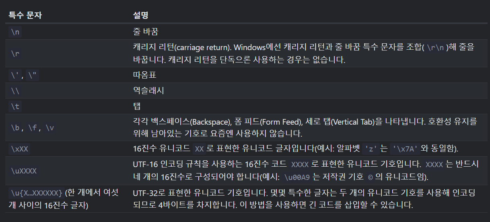
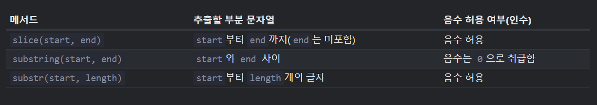

## 문자열
자바스크립트에는 글자 하나만 저장할 수 있는 별도의 자료형이 없다. 모든 글자는 문자열로 저장된다.

<br></br>

## 따옴표
- 작은 따옴표
- 큰 따옴표
- 백틱(\`~\`)

백틱에는 표현식을 `${...}` 로 감싸서 백틱으로 감싼 문자열 중간에 넣으면 표현식을 쉽게 문자열 중간에 삽입할 수 있다(template literal)

```javascript
function sum(a, b) {
    return a + b;
}


alert(`1 + 2 = ${sum(1, 2)}.`); // 1 + 2 = 3.
```

백틱을 사용하면 문자열을 여러 줄에 걸쳐 작성할 수도 있다.

```javascript
let guestList = `손님:
* John
* Pete
* Mary
`;

alert(guestList)
```

<br></br>

## 특수기호


모든 특수문자는 이스케이프 문자 라고 불리는 역슬래시`(\)` 로 시작한다.
<br>

문자열 내에 따옴표를 넣을 때도 역슬래시를 사용할 수 있다.
```javascript
alert('I\'m the Walrus!');
```

<br></br>


## 문자열의 길이
`length` 프로퍼티에는 문자열의 길이가 저장된다.

```javascript
alert(`My\n`.length); // 3s
```

<br></br>


## 특정 글자에 접근하기
문자열 내 특정 위치인 `pos`에 있는 글자에 접근하려면 `[pos]` 같이 대괄호를 이용하거나 `str.charAt(pos)` 라는 메서드를 호출하면 된다.

```javascript
let str = `Hello`;


alert(str[0]); // H
alert(str.charAt(0)); // H

alert(str[str.length - 1]); // o
```

두 방식은 접근하려는 위치에 글자가 없는 경우 차이를 보이는데 `[]` 는 `undefined` 를, `charAt` 은 빈 문자열을 반환한다.

```javascript
let str = `Hello`;

alert(str[100]); // undefined
alert(str.charAt(100)); // ''
```

`for..of` 를 사용하면 문자열을 구성하는 글자를 대상으로 반복 작업도 가능하다.

```javascript
for (const char of `Hello`) {
    alert(char);
}
```

<br></br>

## 문자열의 불변성
문자열은 수정할 수 없고 아예 새로운 문자열을 만들어서 이를 원래 변수에 할당해야 합니다.

```javascript
let str = 'Hi';

str[0] = 'h'; // 에러
```

```javascript
let str = 'Hi';

str = 'h' + str[1];
alert(str); // hi
```

<br></br>

## 대소문자 변경하기
`toLowerCase()` : 대문자를 소문자로<br>
`toUpperCase()` : 소문자를 대문자로

<br></br>

## 부분 문자열 찾기

### str.indexOf(substr, pos)
문자열 `str` 의 `pos` 에서부터 시작해 부분 문자열 `substr`이 어디에 위치하는지를 찾아준다. 원하는 부분 문자열을 찾으면 그 위치를 반환하고 그렇지 못하면 -1 을 반환

```javascript
let str = 'Widget with id';

alert( str.indexOf('Widget') ); // 0
alert( str.indexOf('widget') ); // -1

alert( str.indexOf('id') ); // 1
```

### includes, startsWith, endsWith
`str.includes(substr, pos)` : `str`에 부분 문자열 `substr`이 있는지에 따라 `true` 나 `false` 반환
<br>

`str.startsWith(substr)` : `str`이 특정 문자열로 시작하는지
<br>

`str.endsWith(substr)` : `str`이 특정 문자열로 끝나는지


<br></br>

## 부분 문자열 추출하기

`str.slice(start [, end])`
- 문자열의 `start` 부터 `end`까지 (`end`는 미포함)를 반환한다.

```javascript
let str = `stringify`;

alert(str.slice(0, 5)); // strin
alert(str.slice(0, 1)); // s
```

`end` 가 생략된 경우 문자열 끝까지를 반환

```javascript
let str = `stringify`;

alert( str.slice(2)); // ringify
```

음수 인덱스도 가능!

<br>

`str.substring(start [, end])`
- `start`와 `end` 사이에 있는 문자열을 반환<br>

단, start 가 end 보다 크면 알아서 작은 값을 시작으로 해서 부분 문자열을 반환

```javascript
let str = "stringify";

alert(str.substring(2, 6)); // ring
alert(str.substring(6, 2)); // ring

alert(str.slice(2, 6)); // ring
alert(str.slice(6, 2)); // ''
```
대신 `slice` 와는 달리 음수 인덱스를 허용하지 않는다.

<br>

`str.substr(start [, length])`
- `start` 에서부터 시작해 `length` 개의 글자를 반환



<br></br>

## 문자열 제대로 비교하기
`str.localeCompare(str2)` 를 호출하면 `ECMA-402` 에서 정의한 규칙에 따라 문자열 간의 대소 비교가 가능하다.

`str` < `str2` : 음수 반환<br>
`str` > `str2` : 양수 반환<br>
`str` == `str2` : 0 반환